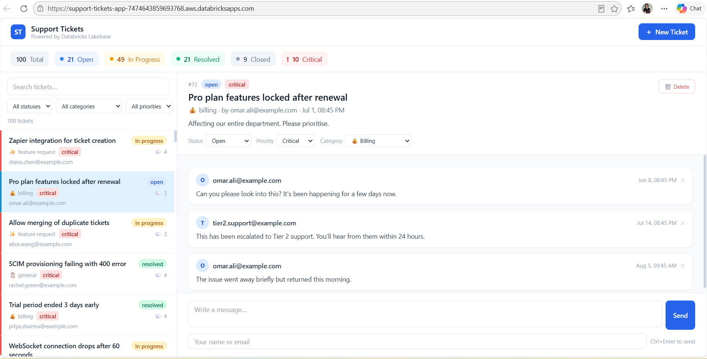

# Support Tickets — Databricks Lakebase App

A full-stack internal support ticketing system built on **Databricks Apps** with **Lakebase (managed Postgres)** as the production data store. Built as Day 1 homework for the Zach Wilson AI Data Engineer Bootcamp.

## 

## Features

- View, create, update, and delete support tickets
- Add and delete messages on tickets
- Filter by status, category, and priority
- Live search across tickets
- Stats dashboard (total, open, in progress, resolved, critical)
- Delete with confirmation step
- Input validation with inline error messages
- 100 pre-loaded sample tickets across all statuses and categories

## Tech stack

- **Backend**: Python / Flask
- **Database**: Databricks Lakebase (managed Postgres)
- **Frontend**: HTML + Alpine.js + Tailwind CSS
- **Deployment**: Databricks Apps

## Project structure

```
ticketing-app/
├── app.py              # Flask API (tickets + messages CRUD)
├── lakebase.py         # Lakebase connection helper
├── db.py               # Schema creation + 100-row seed data
├── app.yaml            # Databricks Apps deployment config
├── setup_secrets.py    # One-time secret setup script
├── requirements.txt
├── .env.example        # Local dev template
└── templates/
    └── index.html      # Single-page frontend
```

## Setup

### 1. Store your Lakebase URL as a Databricks secret

Run in a Databricks notebook:

```python
import getpass
from databricks.sdk import WorkspaceClient
from databricks.sdk.service import workspace

w = WorkspaceClient()
try:
    w.secrets.create_scope(scope="database")
except: pass

url = getpass.getpass("Paste your Lakebase URL: ")
w.secrets.put_secret(scope="database", key="lakebase-url", string_value=url)
w.secrets.put_acl(scope="database", principal="users", permission=workspace.AclPermission.READ)
print("Done!")
```

### 2. Deploy as a Databricks App

1. Push this repo to GitHub
2. In Databricks → **Compute → Apps → Create app → Custom**
3. Connect your GitHub repo
4. Add a **Secret** resource: scope `database`, key `lakebase-url`
5. Click **Deploy**

### 3. Local development

```bash
cp .env.example .env
# Fill in LAKEBASE_URL in .env
pip install -r requirements.txt
python app.py
```

## API endpoints

| Method | Endpoint | Description |
|--------|----------|-------------|
| GET | `/api/stats` | Ticket counts by status |
| GET | `/api/tickets` | List tickets (filter by status/category/priority) |
| POST | `/api/tickets` | Create a ticket |
| GET | `/api/tickets/<id>` | Get ticket + messages |
| PATCH | `/api/tickets/<id>` | Update status/priority/category |
| DELETE | `/api/tickets/<id>` | Delete ticket |
| POST | `/api/tickets/<id>/messages` | Add a message |
| DELETE | `/api/messages/<id>` | Delete a message |

